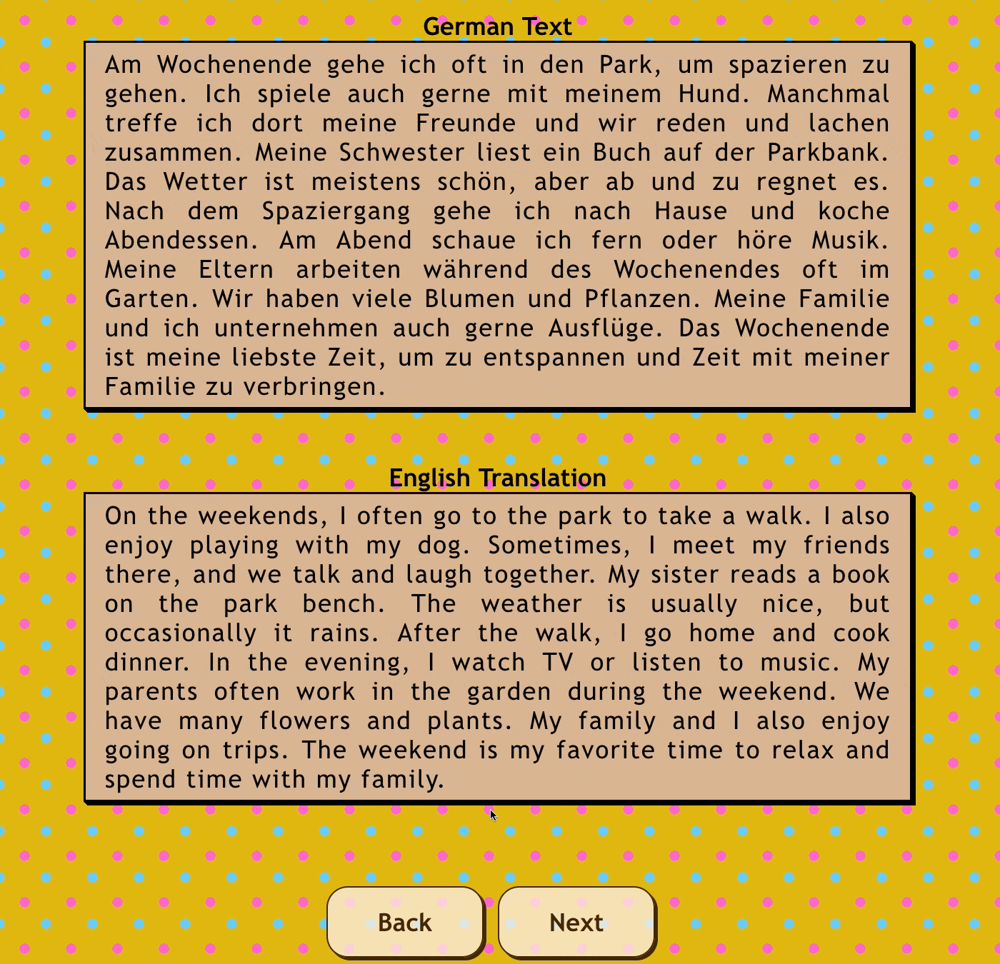

# German Reading Practice App
<p align="justify">
    This React app is designed to help improve German reading comprehension.
    <!-- The app can easily be extended to support other languages as well. -->
</p>

## Description
<p align="justify">
    The app displays German texts along with their English translations. It provides a smooth highlight translation feature which enables users to highlight a portion of the German text and see the instant English translation in a popup. Users can also navigate between different texts using Next and Back buttons.
</p>

### Highlight Translation
<p align="justify">
    To translate a highlighted section, I used two different services: first, I used the <a href="https://github.com/LibreTranslate/LibreTranslate">LibreTranslate API</a> which is a free and open source machine translation API, entirely self-hosted. Fot this, you need to install LibreTranslate API on your local machine. Another service is <a href="https://cloud.google.com/translate/docs/reference/rest/v2/translate">Google Translate API</a>, for which you need to get an API key.
    <br><br>
    Alternatively, you can make API calls to the LibreTranslate API hosted on <a href="https://libretranslate.com/">their website</a> by getting <a href="https://portal.libretranslate.com/">their API key</a>, or use one of the <a href="https://github.com/LibreTranslate/LibreTranslate?tab=readme-ov-file#mirrors">public LibreTranslate mirrors</a>. Additionally, you can use any third-party translation services (like DeepL, Bing Translator, etc.). Just make sure to update API call in '<a href=src/App.js>App.js</a>' accordingly.
</p>

<p align="center">
  
</p>

## How to Run
### Prerequisites
Ensure that `Node.js` and `npm` are installed on your machine. If you want to use LibreTranslate API, install it as well. Otherwise, get an API key for Google Translate API.
### Run
```
git clone https://github.com/amrznik/german-reading-app.git
cd german-reading-app
npm install
npm start
```

## Credits
<p align="justify">
The sample texts in '<a href=src/data/text-data.txt>text-data.txt</a>' have been generated by ChatGPT. The app uses LibreTranslate API / Google Translate API to provide instant translation for a highlighted section.
</p>
